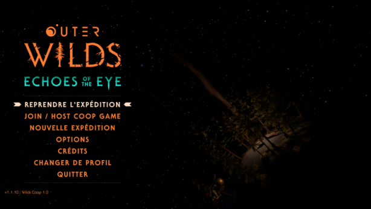

# Outer Wilds Coop

The goal of this project is to create a mod that will allow you to play the game easily with your friends and to discover it together.

For now this project is in progress, so it does not work yet.

## Getting Started

How to install Outer Wilds Coop in 3 step ?

- To install Outer Wilds Coop you have to install [Melon Loader](https://melonwiki.xyz/#/?id=requirements) first in your Outer Wilds installation, you just have to follow the steps of [the automated installer](https://github.com/HerpDerpinstine/MelonLoader/releases/latest/download/MelonLoader.Installer.exe) of melon loader.

- After you need the .dll mod, and yes otherwise it will be difficult to make it work 😁, you can get it [here](https://github.com/C4NX/OuterWildsCoop/releases/latest/download/WildsCoop.dll).

- Normally with the installation of melon loader you should have a 'mods' folder in your game directory, place the mod **WildsCoop.dll** file in it.

And now you only have to launch the game !

## Help us

How to modify and use your own version of the mod ?

- First you have to clone the repo

```shell
git clone https://github.com/C4NX/OuterWildsCoop.git
cd OuterWildsCoop/
```

- Modify your project [WildsCoop.csproj](src/WildsCoop/WildsCoop.csproj) references with your Outer Wilds game path in **OuterWilds_Data\\Managed** and **MelonLoader\\**.
- Modify your project [WildsCoop.csproj](src/WildsCoop/WildsCoop.csproj) output path with your Outer Wilds game path.

- And you might be able to start modifying it !

## Screenshots



## Issues

- Depending on the version you use outer wilds, it is possible that you have a 'user32.dll' file in the **'OuterWilds_Data\Plugins\x86_64'** directory, Melon Loader will crash if you have it so delete it.